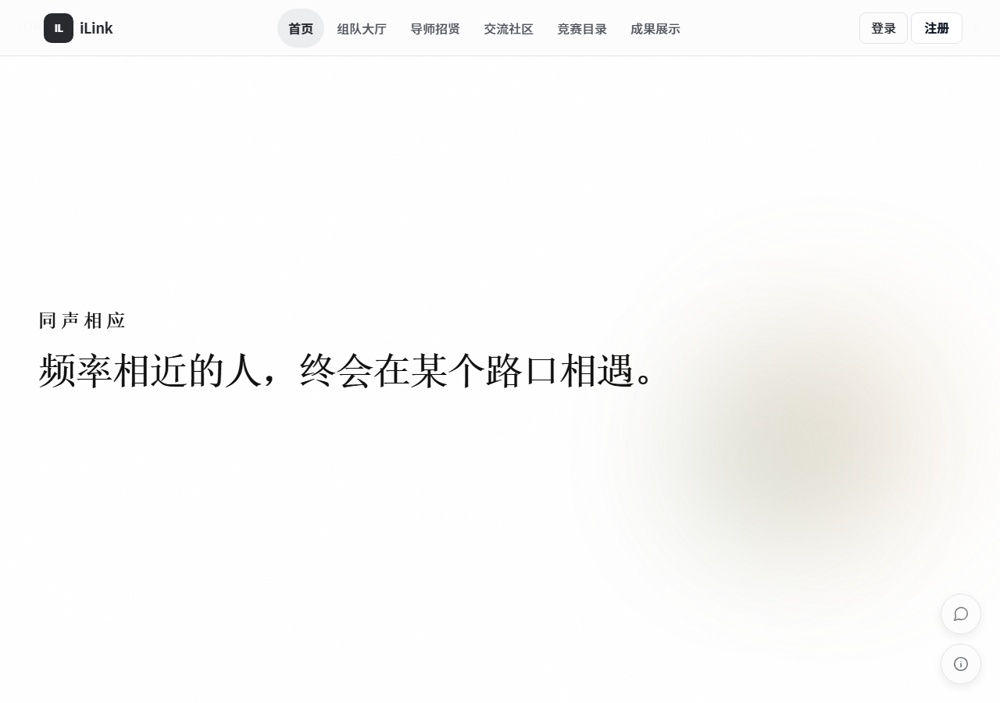
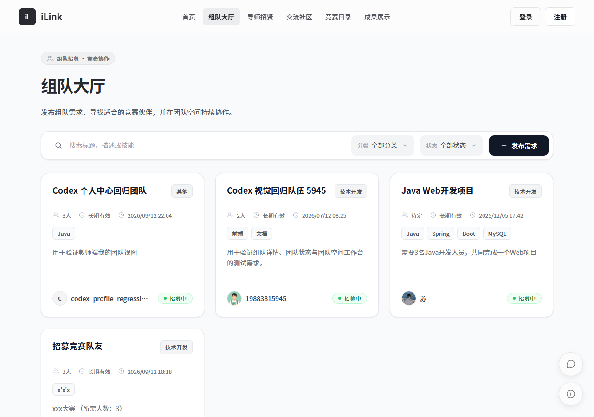
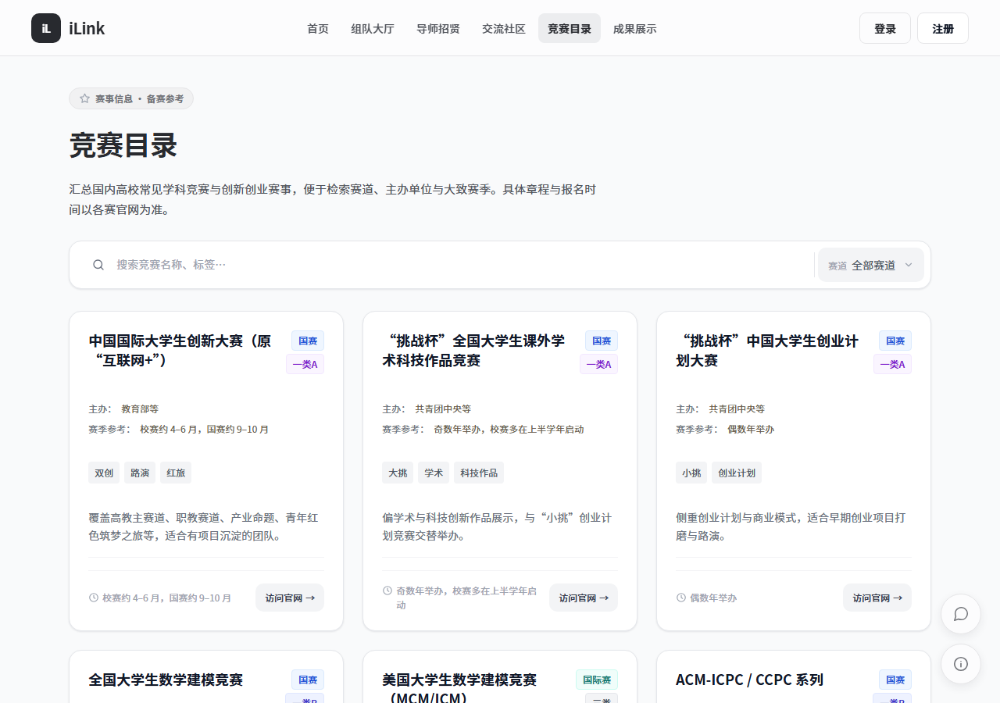
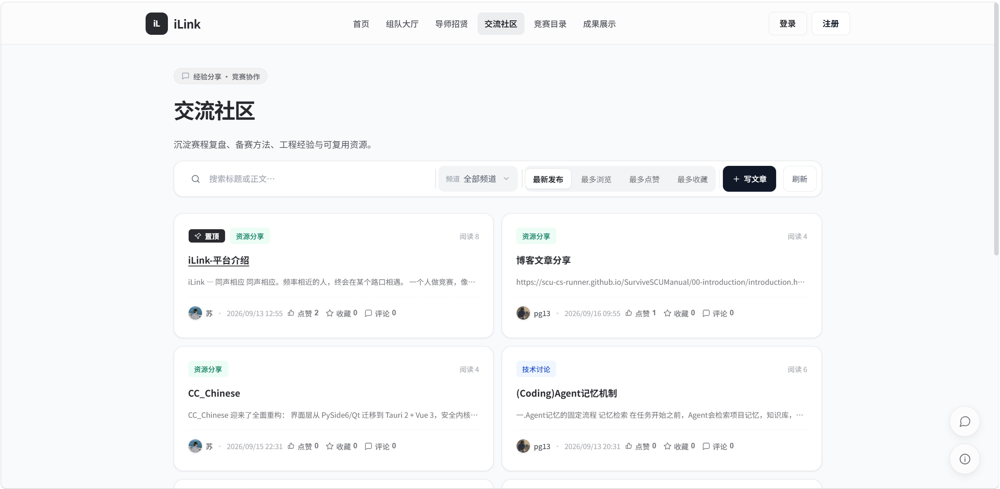
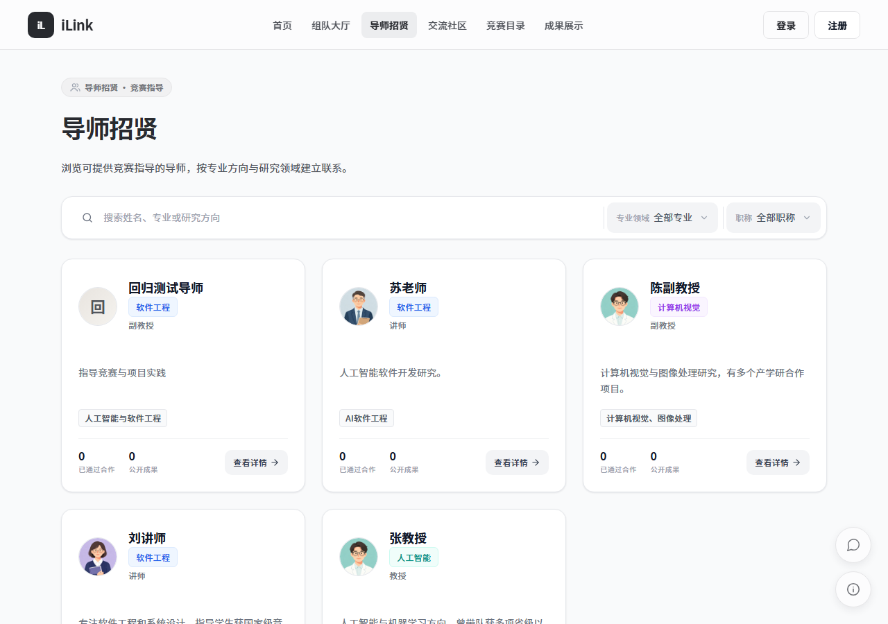
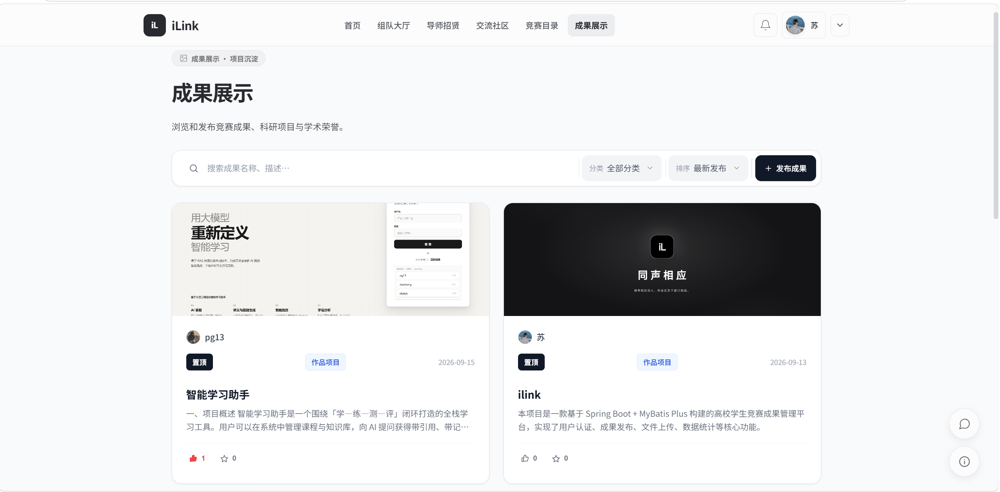
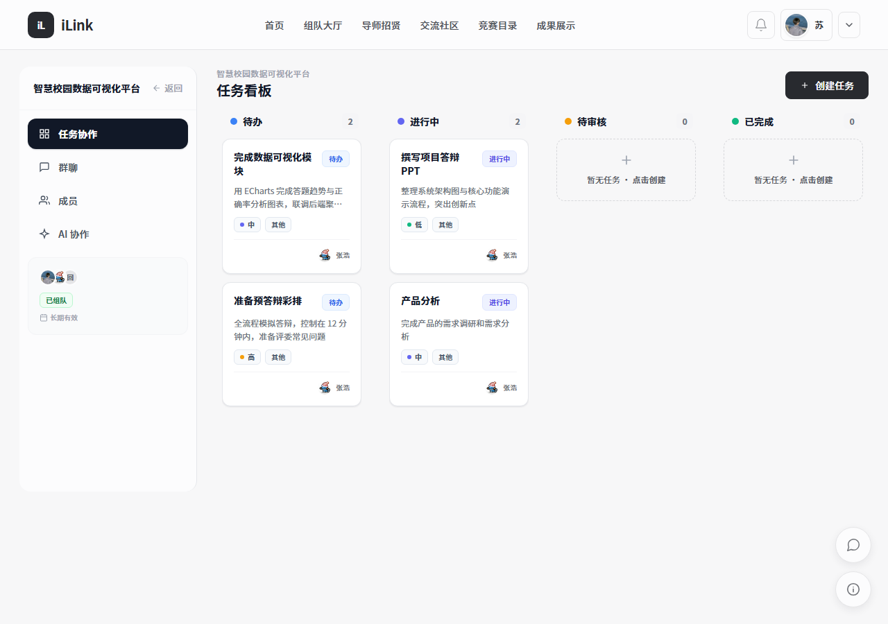
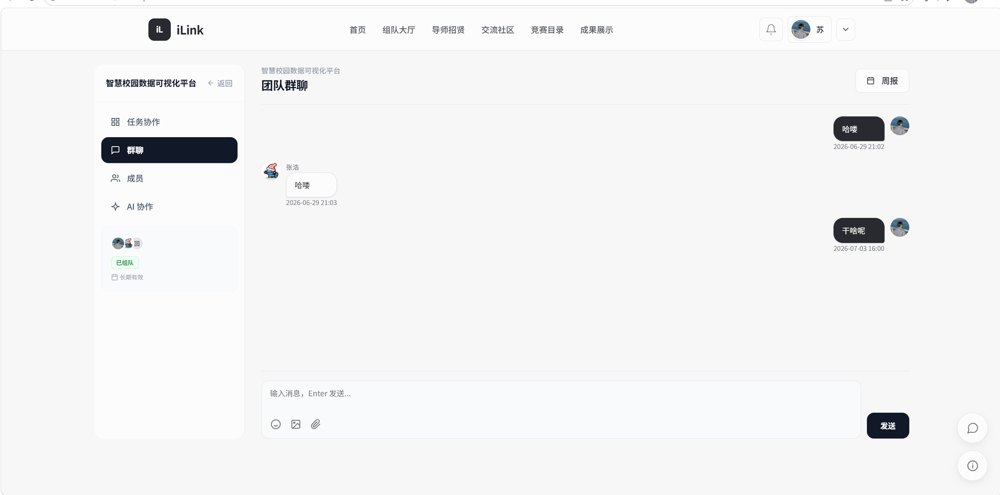
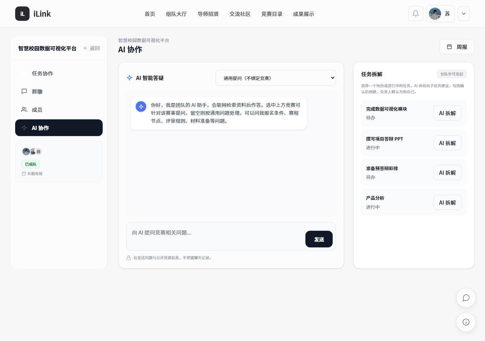

# iLink — 同声相应

> **同声相应。频率相近的人，终会在某个路口相遇。**
>
> 一个人做竞赛，像在黑暗里划火柴。
> iLink 把你的队友、导师、作品、资料连成一条线——从第一次组队，到最终站上领奖台，全程一个平台走完。

**iLink** 是一个面向高校师生的竞赛组队与协作平台：**组队 · 协作 · 沉淀**，一站走完。

- 上手成本：注册 30 秒，发布第一条组队需求 3 分钟
- 适配对象：竞赛学生、指导教师、平台管理员
- 技术底座：Spring Boot · MySQL · STOMP 实时通信 · AI 协作引擎

---

## 平台此刻（2026-09-13 实时统计）

不是营销数字——每一个都对应一个真实的师生、队伍或作品。

| 18 | 5 | 7 | 55 |
|:---:|:---:|:---:|:---:|
| **注册师生** | **活跃队伍** | **入驻导师** | **收录赛事** |

另有：陈列成果 2 项 · 社区文章 3 篇。

---

## 竞赛不是一个人的全力以赴，是一群人的同频共振

微信群聊被刷走的需求、网盘里遗失的版本、找不到队友的深夜——这些竞赛路上最消耗热情的事，都在 iLink 里被重新设计。

六大模块把整条路径接好线，各管一段：

| # | 模块 | 解决什么 |
|:---:|---|---|
| 01 | **组队大厅** | 让队友来找你。发布需求写清赛道、技能与档期；招募中 / 组队中 / 已组队一目了然；队长审批制，满员自动转协作——组队第一次变得有章法 |
| 02 | **导师招贤** | 只展示已通过审核的导师。研究方向、擅长领域、可带队伍规模清清楚楚；学生申请、导师审批，双向留痕 |
| 03 | **交流社区** | 综合 / 技术 / 竞赛 / 资源四频道。Markdown 长文、点赞收藏、作者主页——把散落各处的经验沉积成可检索的知识库 |
| 04 | **竞赛目录** | 国家级 / 省级 / 校际赛事按级别分档：主办单位、赛季参考、报名窗口一卡齐全。备赛信息，不再靠打听 |
| 05 | **成果展示** | 从项目、论文到开源代码，成果卡支持附件与 Markdown 说明。毕业前的「竞赛作品集」，比简历更有说服力 |
| 06 | **团队空间** | 任务看板五态流转、STOMP 实时群聊、文件共享——访问权限仅限本队成员。从头脑风暴到最终答辩，全程留档 |

---

## 真实界面，不是概念稿

以下截图全部来自 iLink 真实运行实例（桌面 Web 端）。低噪音的界面，让信息自己说话。

### 首页 · 一屏讲清平台

主标语开场，实时统计与六大功能一屏陈列，30 秒读懂 iLink。



### 登录与注册

手机号 / 学号工号 / 用户名 / 邮箱四类凭证任选其一，「记住我」长期免登录；学生 / 教师双角色，30 秒完成注册。

### 组队大厅 · 让队友来找你

技能标签、队伍状态、有效期一屏看全，「发布需求」一步开组。



### 竞赛目录 · 55+ 赛事在手

「互联网+」「挑战杯」「数模」等赛事按级别分档，赛道标签清晰可检索。



### 交流社区 · 四个频道

综合、技术、竞赛、资源分区讨论，长文沉淀，点赞收藏。



### 导师招贤 · 官方入驻

只展示审核通过的导师，方向 / 领域 / 带队规模直观可比。



### 成果展示 · 让作品被人看见

获奖项目、论文、开源代码一张成果卡陈列；毕业时，它就是你的电子作品集。



### 团队空间 · 任务看板

组队成功后，队伍自动获得一个只属于成员的作战室：任务看板「待办 / 进行 / 评审 / 完成」五列流转，任务指派、优先级、负责人一目了然——截图来自真实运行中的队伍。



### 团队空间 · 实时群聊

STOMP 实时消息、历史记录完整留档、附件传输、成员在线列表——从头脑风暴到答辩前夜，所有讨论都在队伍里沉淀。



### 团队空间 · AI 协作

AI 深度嵌进团队协作：智能答疑会联网检索后作答、一键把任务拆解成子任务、按周生成周报。隐私边界写在界面上——仅发送问题与公开竞赛信息，不泄露聊天记录。



---

## 从组队到获奖，四步走完

队伍状态机「招募中 → 组队中 → 已组队」全程可视，每个环节有明确的责任人与动作。

```
01  发布 / 寻找    组队大厅发需求，或按赛道、技能标签找到同频的队伍
02  申请 · 审批    成员提交申请，队长审批；满员自动进入 TEAMING，规则前置透明
03  协作推进      任务看板五态流转（待办/进行/评审/完成/取消），群聊与通知实时同步
04  沉淀展示      获奖后挂上成果展示，收进个人作品集，共同点亮平台陈列
```

---

## 把「不会问」「不会拆」「不会写周报」，交给 AI

iLink 把 AI 嵌进协作场景，而非塞给你一个聊天框。

- **竞赛答疑** —— Bing 检索增强 + SSE 流式回复，规则、备赛资料、往届案例即问即答。
- **任务建议** —— 把「做一套 Web 系统」拆成可排期的任务；AI 只给建议，你确认后才落库。
- **周报聚合** —— 按周自动汇总任务与讨论，导师与队长一眼看清进度。
- **隐私边界** —— AI 调用只发送必要上下文，群聊与个人敏感信息留在本地，不外发。

---

## 学生数据，不该被将就

安全不是功能列表，是设计前提。

- **多凭证登录 + 智能锁定** —— 手机号 / 学号工号 / 用户名 / 邮箱皆可登录；连续失败 5 次锁定 15 分钟，防暴力破解。
- **CSRF 全覆盖** —— Spring Security Cookie 模式，动态页面一律携带 token；写操作裸 POST 直接拒绝。
- **HTML 白名单净化** —— Jsoup 白名单而非黑名单，XSS 攻击面收敛到最小。
- **上传双校验** —— 按业务分档 + 内容嗅探双保险，路径规范化防目录穿越。
- **密码重置不外泄** —— 响应不区分账号存在性，token 只存哈希、30 分钟一次性。
- **236 项单元测试全绿** —— 服务层 / 控制器 / 安全组件 / AI 服务全覆盖，回归零失败。

---

## 三种身份，一套平台

| 身份 | 定位 | 一句话价值 |
|---|---|---|
| **学生** STUDENT | 发起方 | 注册即用：找队友、找导师、发需求、写周报、挂作品；资料完整度决定公开可见度 |
| **导师** TEACHER | 入驻方 | 注册即获导师身份；资料完善自动公开，进入招贤墙，学生申请 / 导师审批 |
| **管理员** ADMIN | 治理方 | 审核导师入驻、管理赛事目录、审计操作日志；不可公开注册，由平台方指定 |

---

## 下一个路口，把你的人找齐

> 注册 30 秒。发布第一条组队需求 3 分钟。剩下的，交给 iLink。

1. 打开注册页，选择学生或教师身份；
2. 完善资料——资料越完整，越容易被同频的人找到；
3. 去**组队大厅**发布需求，或去**导师招贤**提交申请；
4. 组队成功进入**团队空间**：开看板、发消息、按节奏推进。

**即刻加入：** http://localhost:8091/register.html

---

*iLink · 高校竞赛组队与协作平台。本介绍配套同目录 `index.html` 交互式落地页；界面截图来自真实运行实例，数据为 2026-09-13 采集。*
